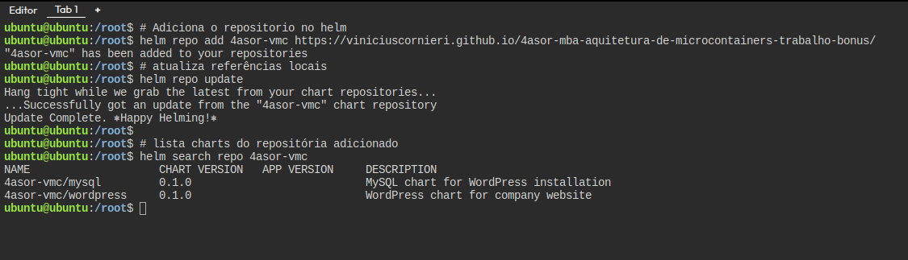

# Trabalho bônus Arquitetura de Microcontainers

Esta página tem como objetivo fornecer os arquivos no formato de [helm-chart](https://helm.sh/) para a infraestrutura de wordpress com banco de dados mysql gerenciado em Kubernetes, é referente a um trabalho bônus do MBA de Arquitetura de Soluções da FIAP da disciplina de Arquitetura de Microcontainers. Esta página e fornecimento do helm-chart pelo github pages foi feito utilizando como base o projeto especificado em [Provision a free personal Helm chart repo using GitHub](https://medium.com/@gerkElznik/provision-a-free-personal-helm-chart-repo-using-github-583b668d9ba4). Os charts e a referência para sua criação estão na branch `gh-pages`, que está referenciada na página [do github pages](https://viniciuscornieri.github.io/4asor-mba-aquitetura-de-microcontainers-trabalho-bonus/)
. nesta branch padrão assume que irá utilizar os charts já criados e publicados por este github.

## Pré-requisitos

* Iremos utilizar a [plataforma Killercoda](https://killercoda.com/) para fazer esse laboratório, então é necessário que já tenha criado uma conta na plataforma. 

### 1. Acessar o Killercoda 

Utilizar um ambiente [Ubuntu 20.04 no Killercoda](https://killercoda.com/playgrounds/scenario/ubuntu). Fazer login caso esteja deslogado.

### 2. Instalar Helm

Os seguintes passos irão instalar o helm na versão 3.x e verificar se está tudo correto.

```sh
# Baixar o script de instalação do Helm
curl -fsSL -o get_helm.sh https://raw.githubusercontent.com/helm/helm/main/scripts/get-helm-3

# Dar permissão de execução
chmod 700 get_helm.sh

# Executar o script de instalação
./get_helm.sh

# Verificar a instalação
helm version

```

Exemplo de saída:


### 3. Instalação do kubernetes

Fazer a instalação do k3s no host como root. Referências: [lab03 - Professor Mussio](https://github.com/lmussio/lab-container-linux/tree/main/lab03)

```shell
# Acessar usuário root
sudo su
# Instalar K3S com kubectl
curl -sfL https://get.k3s.io | sh -
# Habilitar permissão para usuário ubuntu obter configuração de acesso ao K8S
echo K3S_KUBECONFIG_MODE=\"644\" >> /etc/systemd/system/k3s.service.env
# Restart do serviço k3s para carregar nova config
systemctl restart k3s
```
Verificar se o cluster está funcionando:
```shell
# Logar com usuário ubuntu (caso pedir senha, utilizar `ubuntu`)
su ubuntu
# Obter informações dos nós do cluster K8S
kubectl get nodes
# Observe que possuímos uma única instância de K8S
```

exemplo de saída:


### 4. Configurar .kube/config

Para utilizar o helm com esse cluster é necessário configurar o arquivo `.kube/config`

```shell
# cria diretorio .kube
mkdir $HOME/.kube
# copia arquivo de configuração
sudo cp /etc/rancher/k3s/k3s.yaml $HOME/.kube/config
# dá permissão no arquimo
sudo chmod 644 $HOME/.kube/config
```

## Execução do laboratório

### Passo 01 - Adicionar repositório com os charts

Com o Helm e o K3S instalados e configurados, o primeiro passo é adicionar o repositório com os charts do mysql e wordpress no helm:

```shell
# Adiciona o repositorio no helm
helm repo add 4asor https://viniciuscornieri.github.io/4asor-mba-aquitetura-de-microcontainers-trabalho-bonus/

```

Executar um update para atualizar as referências locais, e um search para validar que encontrou corretamente:

```shell
# atualiza referências locais
helm repo update

# lista charts do repositória adicionado
helm search repo 4asor

```

exemplo de saída:


### Passo 02 - Criar um namespace para o wordpress

Vamos criar um namespace para que esta aplicação seja deployada.

```shell
# cria o namespace wordpress no kubernetes
kubectl create namespace wordpress

```

### Passo 03 - Instalar o chart do wordpress

Com o seguinte comando iremos instalar o chart do wordpress que tem como dependência o chart do mysql referenciados [na página](https://viniciuscornieri.github.io/4asor-mba-aquitetura-de-microcontainers-trabalho-bonus/). Redifina as senhas para senhas seguras que serão guardadas como `secret` do kubernetes. 

```shell
# instala chart do wordpress no namespace wordpress
helm install wordpress 4asor/wordpress \
  --namespace wordpress \
  --set mysql.mysql.rootPassword=SuaSenhaSegura123! \
  --set mysql.mysql.password=SuaSenhaPress456! \
  --set mysql.mysql.user=wordpress \
  --set mysql.mysql.database=wordpress

```